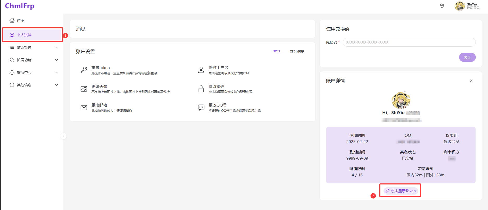

# chmlFrp-cli

命令行工具，用于获取远程FRP配置并启动FRP客户端,启动的客户端均为有头终端（**其实是chmlFrp的快速启动命令**）


**这个做出来其实是给我自己用的，因为平时启动多个客户端我嫌麻烦**

## 项目介绍

chmlFrp-cli 是一个基于 Kotlin 开发的命令行工具，用于简化 FRP (Fast Reverse Proxy) 客户端的配置和启动过程。该工具可以从远程服务器获取隧道配置信息，并自动生成启动脚本来运行 FRP 客户端。


<font color="red">**使用时请将文件夹放在全英文路径下**</font>

<font color="red">**使用时请提前配置好JDK21的环境变量**</font>

<font color="red">**使用时出现一切问题请在chmlfrp官方交流群交流**</font>

<font color="red">**可以提issue，但更新随缘，一般是我用的时候出问题了才会更新**</font>

<u>JDK下载地址：https://www.azul.com/downloads/#zulu</u>
## 功能特点

- 从远程服务器获取 FRP 隧道配置列表
- 支持通过命令行参数或交互式方式选择隧道配置
- 自动生成并执行 FRP 客户端启动脚本
- 跨平台支持 (Windows/Linux)：别问为什么不支持 MacOS，因为我没有Mac的机器
- 支持 token 认证

## 系统要求

- Java 21 或更高版本
- FRP 客户端可执行文件 (frpc.exe 或 frpc)：已经内置Windows和Linux的frp客户端

## 安装方法

1. 下载最新版本的 JAR 文件
2. 确保系统中已安装 Java 21 或更高版本
3. 将 FRP 客户端可执行文件 (frpc.exe 或 frpc) 放置在与 JAR 文件相同的目录中

## 配置说明

首次运行程序时，会在当前目录下创建 `user.config` 配置文件，格式如下：

```
token=您的token值
```

请编辑此文件，填入您的 token 值后再次运行程序。

## 使用方法

### 基本用法

```
java -jar chmlFrp-cli.jar
```

这将以交互式方式显示可用的隧道配置列表，并提示您选择一个配置。

### 命令行参数

```
用法: chmlFrp-cli [-l] [-s=<selectIndex>] [-u=<url>]
命令行工具，用于获取远程FRP配置并启动FRP客户端
  -l, --list              列出所有可用的FRP配置
  -s, --select=<selectIndex>
                          选择配置的序号
  -u, --url=<url>         远程配置列表的URL
```

### 示例

列出所有可用的隧道配置：

```
java -jar chmlFrp-cli.jar --list
```

直接选择并启动指定序号的隧道配置：

```
java -jar chmlFrp-cli.jar --select=0
```

使用自定义 URL 获取隧道配置（其实没啥用）：

```
java -jar chmlFrp-cli.jar --url=http://custom-url.com/api/tunnels
```

## 项目结构

- `src/main/kotlin/Main.kt`: 主程序代码
- `user.config`: 用户配置文件
- `temp/`: 临时目录，用于存放生成的启动脚本

## 构建项目

本项目使用 Gradle 构建系统：

```
./gradlew shadowJar
```

这将在 `build/libs` 目录下生成一个包含所有依赖的可执行 JAR 文件。

## 依赖项

- Kotlin Coroutines: 用于异步操作
- Fastjson2: JSON 解析库
- OkHttp: HTTP 客户端
- Picocli: 命令行参数解析
- Hutool: 工具类库

## 版本信息

当前版本: 1.0.1

## 作者

Shi Yi

